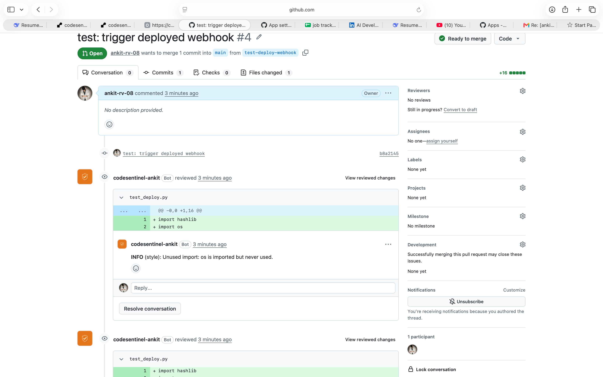
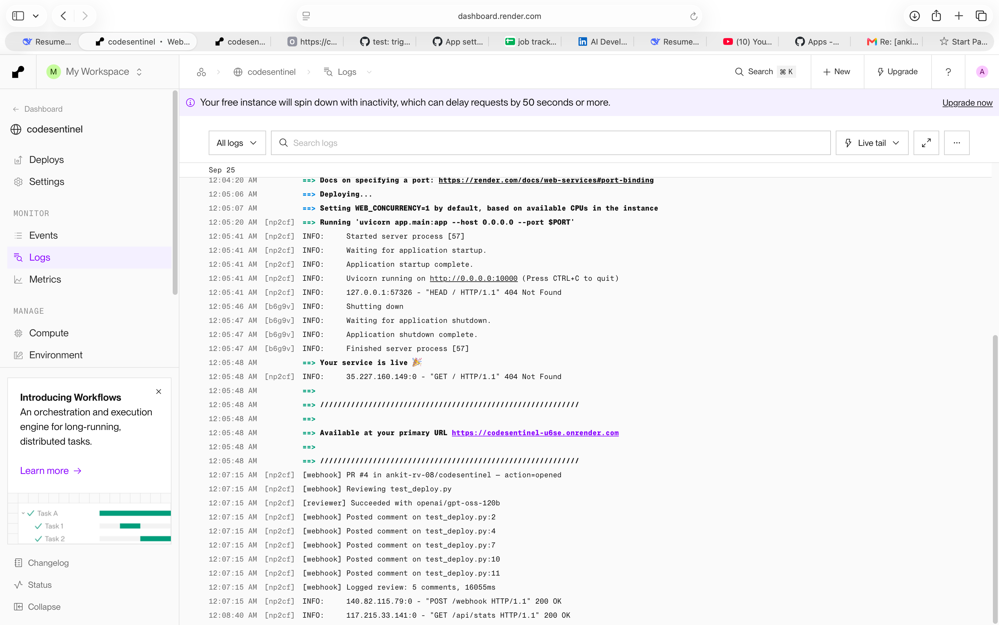
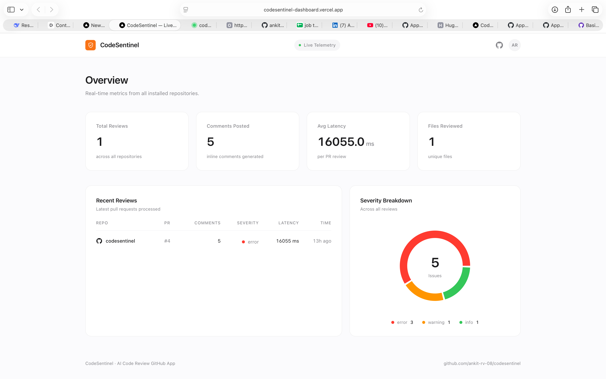

# 🛡️ CodeSentinel

**AI-powered code review GitHub App.** LLM-driven PR reviews with structured inline comments.

FastAPI • GitHub API • Groq GPT-OSS-120B • PostgreSQL • Next.js

[](https://codesentinel-dashboard.vercel.app)
[](https://codesentinel-u6se.onrender.com/health)
[](https://github.com/apps/codesentinel-ankit)
[](LICENSE)

---

## 🔗 Live

| Resource | URL |
|---|---|
| Dashboard | https://codesentinel-dashboard.vercel.app |
| Backend API | https://codesentinel-u6se.onrender.com |
| GitHub App | https://github.com/apps/codesentinel-ankit |
| Source | https://github.com/ankit-rv-08/codesentinel |

---



---

## What it does

CodeSentinel is a GitHub App that reviews pull requests automatically. When a PR is opened or synchronized, it:

1. Receives a `pull_request` webhook from GitHub
2. Verifies the webhook's HMAC signature
3. Fetches the PR diff via the GitHub API
4. Sends each changed file to an LLM with a structured review prompt
5. Parses structured JSON output (bugs, style, security, performance)
6. Posts inline comments back on the PR at the exact line
7. Logs the review to PostgreSQL

---

## What it catches

| Severity | Category | Example |
|---|---|---|
| **error** | bug | Undefined variable, null dereference |
| **error** | security | SQL injection, hardcoded secrets |
| **warning** | bug | Division by zero, missing null check |
| **warning** | security | Weak hashing algorithm (MD5) |
| **warning** | performance | O(n²) loops, unclosed connections |
| **info** | style | Unused imports, naming, formatting |
| **info** | test | Missing tests for new code paths |

Each comment follows the format:
SEVERITY (category): specific, actionable message

text

Example from a real review:
ERROR (security): Hardcoded API key exposed in source code; this secret should be stored securely (e.g., environment variable or secret manager).
WARNING (security): MD5 is used for password hashing, which is cryptographically weak. Use a stronger algorithm like bcrypt, Argon2, or PBKDF2.
ERROR (bug): Variable 'db' is referenced but not defined or imported, causing a NameError at runtime.
ERROR (security): SQL query is built via string interpolation, leading to potential SQL injection. Use parameterized queries instead.

text

---

## Architecture
GitHub PR opened
│
▼
GitHub sends pull_request webhook
│
▼
Render (FastAPI) ← HMAC signature verification
│
▼
GitHub API → fetch PR diff
│
▼
Groq LLM review (model fallback chain)
│ gpt-oss-120b → gpt-oss-20b → qwen3.8-27b
▼
GitHub API → post inline comments
│
▼
PostgreSQL → log review
│
▼
Next.js dashboard on Vercel (reads /api/stats)

text



---

## Tech stack

| Layer | Technology |
|---|---|
| Backend framework | FastAPI |
| GitHub integration | PyGithub + GitHub App |
| LLM | Groq GPT-OSS-120B (fallback chain) |
| Database | PostgreSQL (Render) |
| ORM | SQLAlchemy |
| Dashboard | Next.js 16, TypeScript, Tailwind, Recharts |
| Hosting | Render (backend), Vercel (dashboard) |
| Monitoring | UptimeRobot (5-min health checks) |

---

## Model fallback chain

Regional model availability varies. CodeSentinel tries each model in order and uses the first that responds:

1. `openai/gpt-oss-120b` — strongest reasoning
2. `openai/gpt-oss-20b` — smaller, faster
3. `qwen/qwen3.8-27b` — final fallback

This makes the app resilient to regional outages and quota limits.

---

## Live dashboard



Real-time metrics from PostgreSQL:
- Total reviews, comments posted, average latency, files reviewed
- Recent reviews table (repo, PR #, comment count, severity, latency, timestamp)
- Severity breakdown donut chart

Dashboard source: [codesentinel-dashboard](https://github.com/ankit-rv-08/codesentinel-dashboard)

---

## Install

Visit **https://github.com/apps/codesentinel-ankit** and click **Install**.

Select the repositories you want CodeSentinel to review. It will start commenting on new pull requests within seconds.

---

## Local setup

**Prerequisites:**
- Python 3.11+
- A GitHub App (create at github.com/settings/apps)
- A Groq API key (console.groq.com)
- Cloudflare Tunnel (`brew install cloudflared`)

---

**1. Clone and install**

```bash
git clone https://github.com/ankit-rv-08/codesentinel.git
cd codesentinel
python3 -m venv venv
source venv/bin/activate
pip install -r requirements.txt

---


2. Configure environment

Create .env:

text
GROQ_API_KEY=your_groq_key
GITHUB_APP_ID=your_app_id
GITHUB_PRIVATE_KEY_PATH=github-app.pem
GITHUB_WEBHOOK_SECRET=your_webhook_secret
DATABASE_URL=sqlite:///./codesentinel.db
3. Start the tunnel

bash
cloudflared tunnel --url http://localhost:8000
Set the generated URL as the Webhook URL in your GitHub App settings, with /webhook appended.

4. Start the server

bash
uvicorn app.main:app --reload --port 8000
5. Install the App on a test repo, open a PR, and watch the comments appear.

API

GET /health — health check

json
{"status": "ok", "service": "codesentinel"}
GET /api/stats — aggregate telemetry

json
{
  "total_reviews": 1,
  "total_comments": 5,
  "total_files_reviewed": 1,
  "avg_latency_ms": 16055.0,
  "recent_reviews": [
    {
      "repo": "ankit-rv-08/codesentinel",
      "pr_number": 4,
      "comments_posted": 5,
      "severity_breakdown": {"error": 3, "warning": 1, "info": 1},
      "latency_ms": 16055,
      "created_at": "2026-09-24T18:37:15.795802+00:00"
    }
  ]
}

---


Project structure

text

codesentinel/
├── app/
│   ├── main.py                    # FastAPI entry point
│   ├── db.py                      # SQLAlchemy setup + Review model
│   ├── github/
│   │   └── webhook.py             # Webhook handler, GitHub API, DB logging
│   ├── llm/
│   │   └── reviewer.py            # LLM review engine with model fallback
│   └── api/
│       └── stats.py               # /api/stats endpoint
├── tests/
│   └── test_reviewer.py
├── requirements.txt
├── runtime.txt
└── README.md

---


Status

☑ Core LLM review engine (Groq GPT-OSS-120B)
☑ Model fallback chain for regional availability
☑ GitHub App registration and installation
☑ Webhook handler with HMAC signature verification
☑ PR diff fetching via GitHub API
☑ Structured JSON review output
☑ Inline comment posting
☑ PostgreSQL review logging
☑ /api/stats telemetry endpoint
☑ Production deployment (Render)
☑ Uptime monitoring (UptimeRobot)
☑ Next.js dashboard (Vercel)
☑ Public installability
Roadmap

v0.4 — Configuration

.codesentinel.yml in the repo to control severity thresholds and file exclusions
v0.5 — Rate limiting

Per-installation limits to prevent abuse
v0.6 — Team features

Slack/Discord webhook integration
GitHub Check Runs (in addition to inline comments)

---

Design decisions

Why Groq?
Groq's free tier has enough headroom for real use, and GPT-OSS-120B is a strong reasoning model. The fallback chain handles regional availability issues.

Why a model fallback chain?
Model availability varies by region. A fallback chain ensures the app never fails silently — it just uses the next best model.

Why HMAC signature verification?
GitHub signs every webhook with a shared secret. Verifying the signature ensures the request came from GitHub, not from an attacker trying to trigger reviews.

Why read the PEM into memory instead of passing the path?
PyGithub has issues with relative paths and newline handling. Reading the file into a string avoids InvalidKeyError from unexpected whitespace.

Why lazy env var resolution?
Reading env vars at module load time means a missing var crashes the whole app at import. Reading them inside functions lets the app start, then fail with a clear error only when needed.

---

License

MIT.
